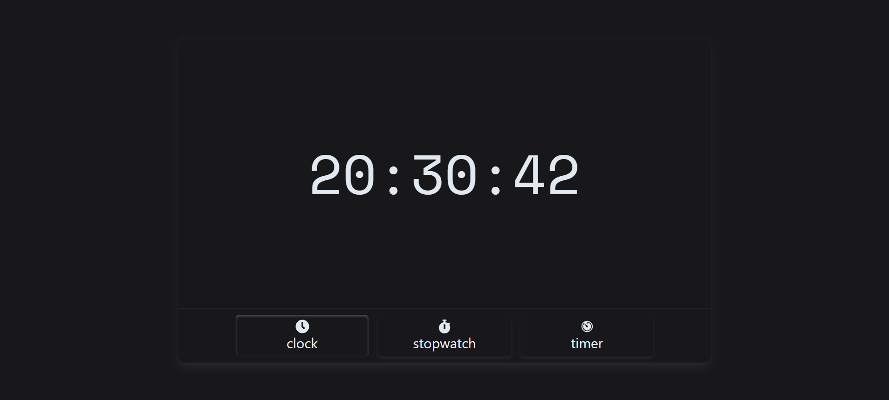
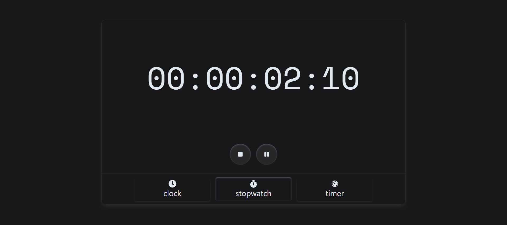
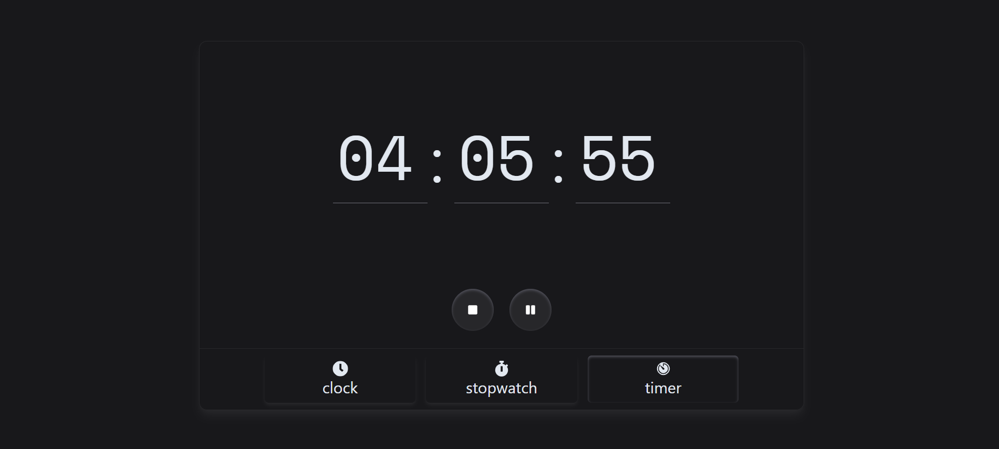

# ⏰ Clock Box

Clock Box is a customizable countdown timer built with React. You can set hours, minutes, and seconds, and start, pause, or stop the timer using clean and modern UI controls.

## 🚀 Features

- ✅ Editable time fields (hours, minutes, seconds)
- ⏯ Start, Pause, and Stop buttons
- ⏱ Real-time countdown with accurate time updates
- 🧠 Logic based on `totalSeconds` to avoid bugs
- 🎨 Simple and clean design

## 📸 Screenshots

<div align="center">
  
  
  
</div>

## 🛠 Tech Stack

- React
- TypeScript
- TailwindCSS
- React Icons

## 📦 Installation

```bash
git clone https://github.com/Mehran-soufi/clock_box.git
cd clock_box
npm install
npm run dev

📁 Project Structure

clock_box/
├── src/
│   ├── components/
│   │   └── Timer.tsx
│   └── App.tsx
├── public/
│   └── index.html
├── screenshot/
│   ├── screenshot1.png
│   ├── screenshot2.png
│   └── screenshot3.png
└── README.md

📃 License
This project is licensed under the MIT License.

⏰ کلاک باکس (Clock Box)
کلاک‌باکس یک تایمر شمارش معکوس قابل تنظیم است که با React ساخته شده. شما می‌توانید ساعت، دقیقه و ثانیه را تنظیم کرده و با استفاده از دکمه‌های مدرن، تایمر را شروع، متوقف یا مکث کنید.

🚀 امکانات
✅ امکان ویرایش ساعت، دقیقه و ثانیه

⏯ دکمه‌های شروع، توقف و مکث

⏱ شمارش معکوس دقیق و لحظه‌ای

🧠 منطق مبتنی بر totalSeconds برای جلوگیری از باگ‌ها

🎨 طراحی ساده و تمیز

📸 تصاویر
<div align="center">
  
  
  
</div>

🛠 تکنولوژی‌های استفاده‌شده
React
TypeScript
TailwindCSS
React Icons

📦 نحوه اجرا
git clone https://github.com/Mehran-soufi/clock_box.git
cd clock_box
npm install
npm run dev

📁 ساختار پروژه
clock_box/
├── src/
│   ├── components/
│   │   └── Timer.tsx
│   └── App.tsx
├── public/
│   └── index.html
├── screenshots/
│   ├── screenshot1.png
│   ├── screenshot2.png
│   └── screenshot3.png
└── README.md

📃 مجوز
این پروژه تحت لایسنس MIT منتشر شده است.

ساخته‌شده با ❤️ توسط مهران صوفی
